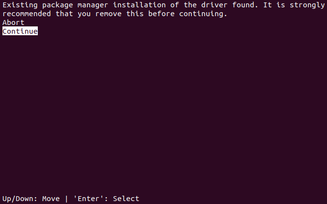

# Setting up environment
## NumPy version compatibility issue
since numpy>=1.20.0 has bunch of deprecation,<br>
the latest version of qiskit(0.23.5) no more supports numpy<=1.19.5<br>
but in order to use pytorch 1.7.1, we have to set python<3.9<br>
and it forces to use numpy 1.19.5, so we will get error if we run `import qiskit`.

my successful **Ubuntu 18.04** environment was as follows

## 1. Install cuda toolkit 10.2
### 1) Install CUDA Toolkit 10.2 and patch 1, patch 2
```
$ wget https://developer.download.nvidia.com/compute/cuda/10.2/Prod/local_installers/cuda_10.2.89_440.33.01_linux.run
$ wget https://developer.download.nvidia.com/compute/cuda/10.2/Prod/patches/1/cuda_10.2.1_linux.run
$ wget https://developer.download.nvidia.com/compute/cuda/10.2/Prod/patches/2/cuda_10.2.2_linux.run
$ sudo sh cuda_10.2.89_440.33.01_linux.run
$ sudo sh cuda_10.2.1_linux.run
$ sudo sh cuda_10.2.2_linux.run
```

+) warnings



If you have warning like above, first select **Abort** then try below
```
$ sudo sh cuda_10.2.89_440.33.01_linux.run --toolkit --silent --override
$ sudo sh cuda_10.2.1_linux.run --toolkit --silent --override
$ sudo sh cuda_10.2.2_linux.run --toolkit --silent --override
```

### 2) Check CUDA toolkit version
First, to enable `nvcc` we need to add these lines at the end of `~/.profile`
```
export PATH=/usr/local/cuda-10.2/bin${PATH:+:${PATH}}
export LD_LIBRARY_PATH=/usr/local/cuda-10.2/lib64\
                         ${LD_LIBRARY_PATH:+:${LD_LIBRARY_PATH}}
```
Then we can check CUDA toolkit version.
```
$ nvcc -V
$ nvcc --version
```


## 2. Install Anaconda3
Install Anaconda3 in terminal
```
$ curl -O https://repo.anaconda.com/archive/Anaconda3-2020.11-Linux-x86_64.sh
$ bash Anaconda3-2020.11-Linux-x86_64.sh
```

## 3. Create conda env & Install packages
```
$ conda create -n qistorch python=3.8
$ conda activate qistorch

$ pip install numpy==1.19.5
$ pip install qiskit==0.23.4
$ conda install pytorch torchvision torchaudio cudatoolkit=10.2 -c pytorch
```

## 4. Check installation
```
$ python3
>>> import qiskit
>>> qiskit.__qiskit_version__['qiskit']
'0.23.4'
>>> import torch
>>> torch.__version__
'1.7.1'
>>> import numpy
>>> numpy.__version__
'1.19.2'
```
